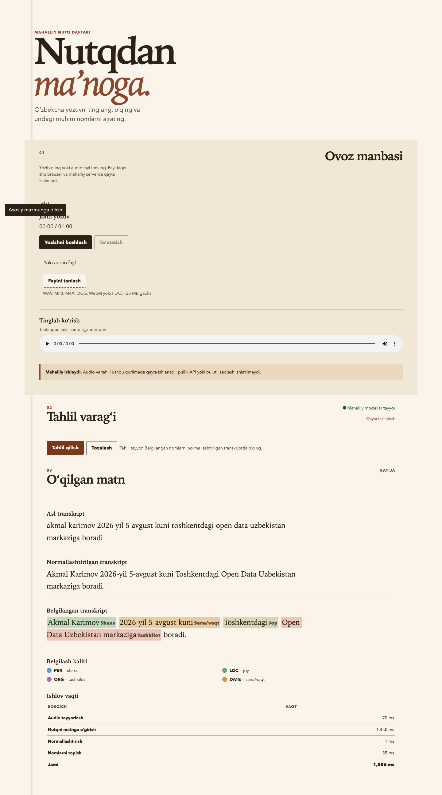

# Uzbek Speech Entity Extractor

This local application transcribes Uzbek audio and extracts PER, DATE, ORG, and LOC spans.
Audio processing remains local; recordings, raw audio, and complete transcripts are not
stored or logged by default.

Audio inference includes a precision-first, deterministic speech rescue layer after the
clean NER model. An aligned speech-only analysis view can truecase reviewed names, render
safe spoken dates in the model's written form, and turn a narrow filler whitelist into hard
punctuation boundaries. The displayed transcript remains the sole source of character
offsets; every analysis-view model span is projected back to that untouched text.

Both speech additions can be rolled back independently with:

```bash
SPEECH_NER_RESCUE_ENABLED=false make run
SPEECH_NER_ANALYSIS_NORMALIZATION_ENABLED=false make run
```

Text analysis always remains clean-model-only. Pure rule candidates expose their source and
evidence without presenting rule support as neural confidence.



_The documentation capture uses a deterministic mocked API result so it does not load models or
present itself as benchmark evidence._

## Architecture

```text
Microphone/upload → validation + bounded decode → 16 kHz mono preprocessing
                  → local Uzbek Whisper → raw transcript
                  → conservative normalization → local multilingual NER
                  → speech-only rescue/projection → validated PER/LOC/ORG/DATE spans
                  → FastAPI JSON → safe DOM text/mark rendering
```

Models are constructed once and loaded during the FastAPI lifespan, never inside request
handlers. The displayed normalized transcript remains the only coordinate space used by public
entity offsets.

## Install and run

Prerequisites are Python 3.11 or 3.12 and FFmpeg (needed when libsndfile cannot decode M4A,
WebM, or OGG directly). On macOS, install FFmpeg with `brew install ffmpeg`.

Create a Python 3.11 virtual environment (Python 3.12 is also supported), then install the
development dependencies and the local package:

```bash
python3.11 -m venv .venv
source .venv/bin/activate
make install-dev
```

If Python 3.12 is preferred, pass `PYTHON=python3.12` to the `make` commands.

Start the configured local server and open <http://127.0.0.1:8000>:

```bash
make run
```

`make run` reads `app.host` and `app.port` from `configs/app.yaml`; `APP_HOST` and `APP_PORT`
provide explicit overrides (useful when port 8000 is occupied). Model identifiers, cache paths,
upload limits, confidence thresholds, and speech-only feature flags are also externalized in
config or documented environment variables.

## Verification

```bash
python -m compileall src training evaluation
make test
make lint
make typecheck
```

`make test` skips model-backed slow tests. Run `make test-slow` only after the local Whisper and
NER artifacts are available; slow tests remain local-files-only.

## Training and model selection

Prepare the pinned `uznlp-uz/uzbek_NER` dataset, train clean and safely augmented baselines, and
evaluate them with:

```bash
make prepare-ner
make train-ner-clean
make train-ner-augmented
make evaluate-ner
```

`training/compare_ner_runs.py` can write a provisional validation comparison at any time, but
promotion to `models/ner/final` now requires a finalization-evidence JSON file containing, for
both `clean` and `augmented`, end-to-end macro/per-class F1, clean-text entity F1, inference
latency, and at least two seed scores. Its declared `selected_run` must match the deterministic
evidence ranking; otherwise promotion is refused.

Two-seed stability runs are reproducible with `configs/ner_clean_seed43.yaml` and
`configs/ner_augmented_seed43.yaml`. The original runs use seed 42; the replicas use seed 43.
Their selected checkpoints, hashes, validation/test scores, ranges, and standard deviations are
recorded in `reports/ner_stability.json`.

The speech-specific transcript fixture is in `tests/fixtures/speech_ner_eval.jsonl`. It
contains 50 lowercase, punctuation-light, filler/apostrophe/boundary cases and 20 hard
negatives. Run its exact-span and local latency gate with:

```bash
python -m pytest tests/integration/test_speech_ner_evaluation.py
```

Rebuild and evaluate the deterministic speech-aware fine-tuning corpus with:

```bash
python training/build_speech_ner_dataset.py --config configs/ner_speech_candidate.yaml
python training/train_ner.py --config configs/ner_speech_candidate.yaml
python training/evaluate_speech_ner.py \
  --checkpoint models/ner/speech-candidate-20260806-v1 \
  --confidence-threshold 0.80
```

The current promoted model and its release gates are recorded in
`reports/ner_speech_candidate_20260806_v1_release_gate.json`.

### Modal public-data continuation

The V5 continuation starts from the exact promoted model in `models/ner/final`, never from the
base multilingual checkpoint or a rejected continuation. Four isolated CPU jobs run in parallel:
UzNER expert labels, UzNER temporal labels, Common Voice Uzbek transcript mining, and Uzbek
Speech Corpus transcript mining. Each publishes a checksum manifest last to its own Modal Volume
prefix. A single deterministic finalizer then caps generic public records, removes exact protected
set overlap, reserves a source-stratified speech-year dev set, and writes the frozen training
release. Only after that manifest is complete are the two L4 seed runs submitted together.
The unchanged promoted-v1 comparison runs alongside them on CPU, so the peak GPU request remains
two L4s.

The promoted local model is never replaced by this runner. A candidate must still pass the clean
test, immutable speech fixture, held-out public speech-year, two-seed agreement, and supplied OGG
diagnostic gates before a separate promotion step is allowed.
The remote reports are evidence inputs, not a promotion decision; the private OGG stays local and
the final gate must fail closed unless both downloaded seeds satisfy every threshold.
Seed reservations also fail closed: a failed run is marked `failed` and cannot be retried into the
same output prefix. Inspect the partial Volume tree and reservation before any manual cleanup, or
use a new validated release name; never clear a live `running` reservation.

```bash
export MODAL_TOKEN_ID="<modal-token-id>"
export MODAL_TOKEN_SECRET="<modal-token-secret>"
python -m pip install -r requirements-modal.txt
.venv/bin/modal run training/modal_public_ner_v5.py --phase prepare
.venv/bin/modal run training/modal_public_ner_v5.py --phase train --seed both
```

Use `--phase all --seed both` for the same dependency-ordered workflow in one command. The four
preparation jobs and the two seed jobs are independently parallel; finalization is intentionally a
barrier between them. Environment credentials are enough; no credential is written into this
repository. Prepared data is published to `uzbek-speech-ner-public-data-v5`; candidate runs are
published to `uzbek-speech-ner-public-v5-runs` without automatic promotion.

Download `inference/manifest.json` first, then download every filename listed under its `files`
mapping individually. Require the exact file set, byte sizes, and SHA-256 values before evaluating
the bundle; do not recursively download a checkpoint directory or treat a directory without the
manifest as complete.

```bash
.venv/bin/modal volume get uzbek-speech-ner-public-v5-runs \
  public-ner-v5-20260807/public-continuation-20260807-v5-seed1/inference/manifest.json \
  ./models/ner/public-continuation-20260807-v5-seed1/manifest.json
.venv/bin/modal volume get uzbek-speech-ner-public-v5-runs \
  public-ner-v5-20260807/public-continuation-20260807-v5-seed1/inference/model.safetensors \
  ./models/ner/public-continuation-20260807-v5-seed1/model.safetensors
```

Build the local contextual-name lexicon from the prepared clean BIO training split with:

```bash
python training/build_name_lexicon.py
```

## Private evaluation and reproducibility

Private evaluation is intentionally data-gated. Collect consented recordings using the workflow
in `data/private_test/README.md`; the default runners refuse a corpus that does not satisfy the
100–300 recording, five-speaker, duration, condition, content, and per-class coverage rules.

```bash
make plan-evaluation
make import-recordings
make collection-progress
make validate-evaluation
make evaluate-stt
make evaluate-pipeline
make error-report
```

STT prediction rows record the configured model ID and resolved Hugging Face revision. Pipeline
evaluation rejects stale/wrong model provenance and mixed revisions. Audio ablations report both
surface-mention F1 and strict exact-span F1 by projecting only exactly aligned STT tokens into
gold coordinates; a mistranscribed entity cannot receive exact-span credit.

Smoke evaluation requires the explicit `--allow-incomplete-dataset` flag and produces provisional
outputs only. Detailed transcript-bearing rows stay under the Git-ignored
`data/private_test/results/`; aggregate transcript-free reports are written under `reports/`.

## Current measured results

The promoted speech-aware NER candidate passed its local 50-record speech fixture release gates:
combined precision **0.9565**, recall **0.8800**, F1 **0.9167**, and mean NER latency
**57.5 ms**. On the prepared clean NER test split its four-class macro F1 is **0.8381** (PER
0.9619, LOC 0.8029, ORG 0.7448, TEMPORAL 0.8429). Exact artifacts and hashes are in
`reports/ner_speech_candidate_20260806_v1_release_gate.json` and
`reports/ner_speech_promoted_final_20260806_clean_test.json`.

These are NER and controlled speech-fixture results—not the required private end-to-end
benchmark. No compliant real-recording corpus has been collected yet, so Base-vs-Small WER/CER,
real-STT four-class F1, and final error counts are deliberately not claimed.

Clean/augmented two-seed stability is now measured. Validation four-class macro-F1 ranges are
**0.0195** for clean and **0.0028** for augmented; held-out test ranges are **0.0115** and
**0.0016**, respectively. These stability metrics do not substitute for the missing real-audio
end-to-end comparison.

## Privacy and safety

- Audio inference is local and uses no paid API.
- Uploads and preprocessing files are deleted in `finally` blocks.
- Complete transcripts and raw audio are not logged or stored by default.
- Diagnostic transcript logging is opt-in.
- The UI renders model text with text nodes and `<mark>` elements, never unsafe HTML sinks.
- Decoding is bounded before a compressed upload can expand beyond the 60-second policy.
- Speaker identification is not performed.

## Known limitations

- The promoted speech-aware model remains provisional until compliant end-to-end evaluation is
  recorded. Clean/augmented candidates now have two-seed stability evidence; the later
  speech-specific candidate remains a single-seed experiment.
- The held-out OGG diagnostic still detects only a partial learned spoken-year span; the
  deterministic DATE rescue recovers the full displayed result.
- Uzbek-Russian code switching, noisy microphones, rare village names, and organization boundary
  cases need the planned private corpus for reliable measurement.
- First startup may download model artifacts unless local-files-only mode is selected; audio is
  never sent to an inference API.

## Attribution

NER training data comes from
[`uznlp-uz/uzbek_NER`](https://huggingface.co/datasets/uznlp-uz/uzbek_NER), attributed to Elov
B.B. and Alaev R.H. (2026) under CC BY 4.0. The pinned revision and checksum are documented in
`data/README.md`. The public V5 continuation additionally uses the CC BY 4.0 UzNER-Style(v2)
workbook and text-only, pinned transcript columns from Common Voice Uzbek and the Uzbek Speech
Corpus; their revisions and licenses are also documented there. STT uses the local Hugging Face
models `navai-uz/whisper-base-uzbek` and `navai-uz/whisper-small-uzbek`; NER starts from
`distilbert/distilbert-base-multilingual-cased`.

## License

This project is released under the [MIT License](LICENSE).

## Contributing

Development setup, checks, and pull request expectations are in
[CONTRIBUTING.md](CONTRIBUTING.md). Please follow the
[Code of Conduct](CODE_OF_CONDUCT.md). Report vulnerabilities privately using
[SECURITY.md](SECURITY.md)—do not open public issues for secrets or exploits.
